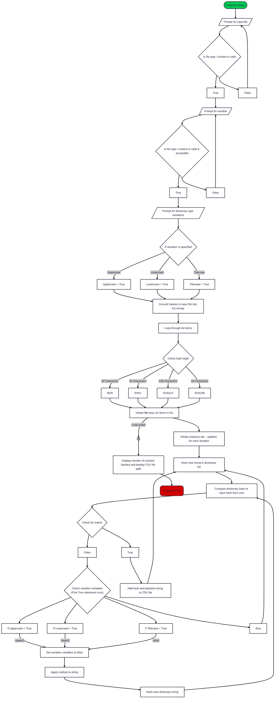

# Dictionary-Based-Password-Cracker

Current version (pre-code) hash cracking algorithm
Can also be found on Mermaid [here](https://www.mermaidchart.com/app/projects/55559564-4b3b-4298-a2aa-04db4e233f2b/diagrams/0b39b44d-468d-4ed4-852f-a402242a71af/version/v0.1/edit).

